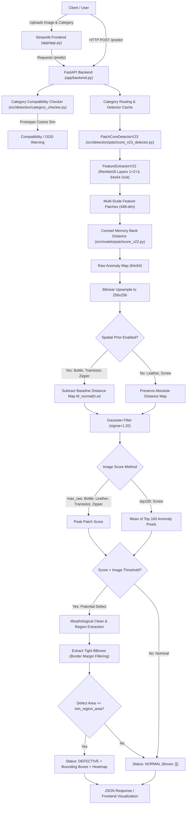

# VisionInspect - Repository Audit & Cleanup Analysis

**Date:** October 5, 2026  
**Branch:** `cleanup/repository-finalization`  
**Target Repository:** `VisionInspect - Industrial Defect Detection & Localization`  
**Validated Environment:** Python 3.12.10, PyTorch 2.2.2+cpu, torchvision 0.17.2+cpu, NumPy 1.26.4, SciPy 1.12.0, scikit-learn 1.4.2  

---

## 1. Executive Summary

This comprehensive repository audit forms the safety checkpoint for finalizing and hardening the **VisionInspect** codebase. The audit inventories every directory, Python script, configuration file, model weight, test suite, and generated artifact across the repository.

### Core Audit Principles & Constraints
1. **Model Weights Freeze:** Absolutely NO model weights are deleted, retrained, modified, or overwritten. Production models (`bottle`, `leather`, `transistor`, `zipper`, `screw`) in `models/<category>/patchcore_v23/` are strictly locked and preserved.
2. **Configuration Integrity:** The screw thread detection fix (`use_spatial_prior: false`, `image_score_method: top100`, `image_threshold: 2.80`, `pixel_threshold: 2.40`) and leather normal-texture calibration (`image_threshold: 2.90`, `pixel_threshold: 1.71`) are strictly preserved.
3. **Audit Evidence Preservation:** The final audited results in `results/Updated_model_predictions/` (`AUDIT_REPORT.md`, `audit_summary.json`, and all 5 per-category prediction visualizations) are fully preserved.
4. **Zero Blind Deletions:** No file is removed without rigorous static dependency analysis, reference checks across code, configuration, tests, and documentation.

---

## 2. Current Repository Structure

```text
VisionInspect/
│
├── .gitignore                                 # Git ignore patterns (protects datasets, caches, huge binaries)
├── LICENSE                                    # MIT License
├── README.md                                  # Primary repository documentation
├── config.yaml                                # Master category-specific configuration
├── inference.py                               # CLI inference entry point
├── requirements.txt                           # Unpinned requirements (to be modernized/unified)
├── requirements-visioninspect-py312.txt       # Environment pip freeze (UTF-16LE, to be cleaned)
├── run_manual_inference.ps1                   # Sample CLI script (contains hardcoded path to fix)
├── setup_project_structure.py                 # Initial project scaffolding script (archive candidate)
├── CLEANUP_REPORT.md                          # Historical cleanup report from Sep 25, 2026 (move to docs/)
├── PHASE_3_PRE_IMPLEMENTATION_AUDIT.md        # Historical Phase 3 audit from Sep 10, 2026 (consolidate into docs/)
│
├── app/                                       # Application Layer (Frontend & Backend)
│   ├── app.py                                 # Streamlit production frontend (interactive UI, batch queue, dark mode)
│   ├── backend.py                             # FastAPI REST service (/health, /categories, /predict, /predict/batch)
│   └── assets/
│       ├── .gitkeep
│       └── icons/
│           ├── visioninspect_3d_logo.png      # High-res 3D inspection brand icon
│           └── visioninspect_3d_logo_72.png   # Streamlit page icon
│
├── assets/                                    # Static visual brand assets
│   ├── carton_box_clean.png                   # Hero banner asset
│   ├── carton_box_scan.jpg / .png             # Hero banner scanning assets
│   ├── carton_damaged.jpg / .png              # Damaged component inspection sample
│   ├── models/                                # Category UI transparent / thumbnail cards
│   │   ├── bottle_transparent.png
│   │   ├── leather_transparent.png
│   │   ├── screw_transparent.png
│   │   ├── transistor_transparent.png
│   │   ├── zipper_transparent.png
│   │   └── web/ (leather_web, screw_web, transistor_web, zipper_web)
│
├── dataset/                                   # Local MVTec AD dataset directory (5.02 GB, ignored by git)
│   └── mvtec_anomaly_detection/
│       ├── bottle/
│       ├── leather/
│       ├── screw/
│       ├── transistor/
│       └── zipper/
│
├── docs/                                      # Project documentation & engineering reports
│   ├── Images/                                # Reference architecture & UI screenshots
│   ├── category_compatibility.md              # Documentation for prototype feature matching
│   ├── phase1_final_report.md                 # Baseline autoencoder milestone report
│   ├── phase1_tweaks_report.md                # Phase 1 tuning notes
│   ├── phase2_2_crack_localization_report.md  # Multi-scale patch feature milestone report
│   ├── phase2_3_precise_crack_localization_report.md # Spatial background prior & localization report
│   ├── phase2_bottle_baseline.md              # PatchCore bottle benchmark
│   ├── phase2_final_report.md                 # Phase 2 wrap-up report
│   ├── phase3_evaluation_integrity.md         # Multi-category evaluation protocol
│   ├── phase3_initial_implementation.md       # Multi-category training & metrics report
│   ├── phase3_pre_implementation_audit.md     # Stub pointer to root audit file
│   └── project_report.md                      # High-level academic course overview
│
├── models/                                    # Model weights & memory banks (1.05 GB total)
│   ├── baseline/bottle/
│   │   ├── autoencoder.pth                    # Baseline PyTorch autoencoder weights (5.27 MB)
│   │   └── config.json
│   ├── bottle/
│   │   ├── autoencoder.pth                    # Tested by tests/test_model.py (5.27 MB)
│   │   ├── patchcore/                         # Tested by tests/test_patchcore.py (31.35 MB)
│   │   ├── patchcore_v22/                     # Tested by tests/test_patchcore_v22.py (146.30 MB)
│   │   └── patchcore_v23/                     # PRODUCTION LOCKED (146.30 MB memory_bank + spatial priors)
│   ├── leather/
│   │   └── patchcore_v23/                     # PRODUCTION LOCKED (171.50 MB memory bank)
│   ├── screw/
│   │   └── patchcore_v23/                     # PRODUCTION LOCKED (224.00 MB memory bank)
│   ├── transistor/
│   │   └── patchcore_v23/                     # PRODUCTION LOCKED (149.10 MB memory bank)
│   ├── zipper/
│   │   └── patchcore_v23/                     # PRODUCTION LOCKED (168.00 MB memory bank)
│   ├── category_prototypes.pt                 # Tracked feature centroids for category compatibility check
│   └── <other 10 mvtec categories>/.gitkeep   # Placeholders for future category extensions
│
├── notebooks/                                 # Jupyter exploration & prototyping
│   ├── 01_dataset_exploration.ipynb           # EDA notebook
│   ├── 02_data_preprocessing.ipynb            # (0 bytes placeholder)
│   ├── 03_autoencoder_training.ipynb          # Baseline training notebook
│   ├── 04_anomaly_detection.ipynb             # Anomaly inference notebook
│   ├── 05_evaluation.ipynb                    # (0 bytes placeholder)
│   ├── plot1.png, plot2.png                   # Generated notebook plots
│
├── results/                                   # Evaluation results and audit evidence
│   ├── Updated_model_predictions/             # FINAL AUDITED EVIDENCE (Preserved)
│   │   ├── AUDIT_REPORT.md                    # Official multi-category audit report
│   │   ├── audit_summary.json                 # Machine-readable per-sample predictions (223 KB)
│   │   └── bottle/, leather/, screw/, transistor/, zipper/ (530 audited visual outputs)
│   ├── Updated_model_predictions.zip          # 425 MB redundant zip archive of folder above (exceeds GitHub limit)
│   ├── evaluation/                            # Latest per-category evaluation json summaries (bottle, leather, screw, transistor, zipper)
│   ├── phase1_final/, phase2/, phase3/        # Historical phase metrics & calibration CSVs
│   ├── predictions/, comparisons/, heatmaps/  # Runtime diagnostic dumps (in .gitignore)
│
├── scratch/                                   # Temporary debug scripts & pickle files (untracked)
│
├── scripts/                                   # Evaluation, calibration & training utilities
│   ├── calibrate_and_lock_thresholds.py       # Global threshold calibration
│   ├── calibrate_phase3_2.py                  # Localization parameter calibration
│   ├── diagnose_localization_pipeline.py      # Diagnostic visualization tool
│   ├── evaluate_model.py                      # Production category evaluator
│   ├── generate_audit_report.py               # Generates AUDIT_REPORT.md from audit_summary.json
│   ├── run_audit_batch.py                     # Executes batch audit on test images
│   ├── train_patchcore.py                     # Official PatchCore v2.3 training pipeline
│   └── <historical evaluation & test scripts>
│
├── src/                                       # Production Source Package
│   ├── data/
│   │   ├── dataset_loader.py                  # PyTorch Dataset for MVTec AD
│   │   └── preprocessing.py                   # Standard transforms (256x256, ImageNet norm)
│   ├── detection/
│   │   ├── patchcore_v23_detector.py          # PRODUCTION DETECTOR (Multi-scale, morphology, tight bbox)
│   │   ├── patchcore_v22_detector.py          # Phase 2.2 detector (preserved for test compatibility)
│   │   ├── patchcore_detector.py              # Phase 2.0 baseline detector (preserved for tests)
│   │   ├── anomaly_detector.py                # Phase 1 Autoencoder detector (preserved for tests)
│   │   ├── category_checker.py                # Out-of-distribution category prototype checker
│   │   ├── anomaly_score.py                   # Scoring strategies (max_raw, top100, etc.)
│   │   ├── heatmap.py                         # Anomaly heatmap generation (Gaussian smoothing)
│   │   └── localization.py                    # Morphological post-processing, bounding boxes
│   ├── evaluation/
│   │   ├── metrics.py                         # AUROC, PRO, Precision, Recall, F1
│   │   ├── pixel_sweep.py                     # Pixel-level threshold search
│   │   ├── roc_curve.py                       # ROC curve computations
│   │   └── visualization.py                   # Multi-panel inspection comparison figures
│   ├── models/
│   │   ├── autoencoder.py                     # Baseline Conv-Autoencoder architecture
│   │   ├── feature_extractor.py               # ResNet18 Layer 2+3 extractor
│   │   ├── patchcore.py                       # Baseline PatchCore implementation
│   │   └── patchcore_v22.py                   # PRODUCTION FeatureExtractorV22 (Layers 1+2+3, 64x64 grid)
│   └── utils/
│       ├── config.py                          # YAML config reader & category configuration helper
│       └── helpers.py                         # Seed utilities and path helpers
│
└── tests/                                     # Automated Test Suite (15 test modules, 94 tests total)
    ├── test_patchcore_v23.py                  # Production v2.3 detector test
    ├── test_model_dispatch.py                 # Detector version routing test
    ├── test_detection.py                      # Baseline detector & localization tests
    ├── test_phase3_2_batch_compatibility.py   # Batch processing & category checker tests
    ├── test_phase3_2_localization.py          # Morphological filtering & border margin tests
    ├── test_phase3_3_transistor.py            # Transistor calibration tests
    ├── test_phase3_multi_category.py          # Multi-category loader & FastAPI integration tests
    ├── test_patchcore_v22.py                  # PatchCore v2.2 unit tests
    ├── test_patchcore.py                      # PatchCore v2.0 unit tests
    ├── test_model.py                          # Autoencoder unit tests
    ├── test_dataset.py                        # Dataset loading tests
    ├── test_inspect_page.py                   # Frontend inspection page state tests
    ├── test_frontend_state.py                 # Streamlit session state tests
    ├── test_app.py                            # Application placeholder test
    └── test_phase3_1_integrity.py             # Security, confidentiality & path test
```

---

## 3. Current Working Entry Points

| Entry Point | Canonical Command | Role | Status |
|:---|:---|:---|:---|
| **Backend REST API** | `uvicorn app.backend:app --host 127.0.0.1 --port 8000` | FastAPI server exposing `/predict`, `/predict/batch`, `/categories`, `/health` | **ACTIVE PRODUCTION** |
| **Streamlit Web UI** | `streamlit run app/app.py` | Production inspection dashboard with 3D animation, queue management, visual heatmaps | **ACTIVE PRODUCTION** |
| **CLI Inference** | `python inference.py --category <name> --image <path> [--model patchcore_v23]` | Direct command-line inspection tool | **ACTIVE PRODUCTION** |
| **Model Evaluation** | `python scripts/evaluate_model.py --category <name>` | Comprehensive AUROC/F1 evaluation on MVTec AD test set | **ACTIVE PRODUCTION** |
| **Batch Audit Tool** | `python scripts/run_audit_batch.py` | Full batch audit generating prediction images and `audit_summary.json` | **ACTIVE PRODUCTION** |
| **Automated Tests** | `pytest tests/ -v` | Comprehensive test suite (14 core tests + 80 multi-phase integration tests) | **ACTIVE PRODUCTION** |

---

## 4. Current Model Locations & Status

| Model Path | Category | Type | Size | Status | Git Policy |
|:---|:---|:---|:---|:---|:---|
| `models/bottle/patchcore_v23/` | `bottle` | PatchCore v2.3 | ~146.8 MB | **PRODUCTION LOCKED** | Local / `.gitignore` (*.pt) |
| `models/leather/patchcore_v23/` | `leather` | PatchCore v2.3 | ~171.7 MB | **PRODUCTION LOCKED** | Local / `.gitignore` (*.pt) |
| `models/screw/patchcore_v23/` | `screw` | PatchCore v2.3 | ~224.2 MB | **PRODUCTION LOCKED** | Local / `.gitignore` (*.pt) |
| `models/transistor/patchcore_v23/` | `transistor` | PatchCore v2.3 | ~149.3 MB | **PRODUCTION LOCKED** | Local / `.gitignore` (*.pt) |
| `models/zipper/patchcore_v23/` | `zipper` | PatchCore v2.3 | ~168.2 MB | **PRODUCTION LOCKED** | Local / `.gitignore` (*.pt) |
| `models/category_prototypes.pt` | All | Prototype Embeddings | 0.01 MB | **ACTIVE** | **Tracked in Git** |
| `models/bottle/patchcore_v22/` | `bottle` | PatchCore v2.2 | ~146.5 MB | **PRESERVED** (Tests) | Local / `.gitignore` (*.pt) |
| `models/bottle/patchcore/` | `bottle` | PatchCore v2.0 | ~31.4 MB | **PRESERVED** (Tests) | Local / `.gitignore` (*.pt) |
| `models/bottle/autoencoder.pth` | `bottle` | Conv Autoencoder | ~5.3 MB | **PRESERVED** (Tests) | Local / `.gitignore` (*.pth) |
| `models/baseline/bottle/autoencoder.pth` | `bottle` | Baseline Reference | ~5.3 MB | **PRESERVED** (Reports) | Local / `.gitignore` (*.pth) |

> [!IMPORTANT]
> Every model directory contains a `metadata.json` which is tracked in Git to maintain configuration, training image count, backbone type, and architecture version even when binary weights are kept local.

---

## 5. Current Configuration Files & Source of Truth

The master configuration file is [`config.yaml`](file:///x:/VScode/Artificial_intelligence_n_Machine_learning/VisionInspect/config.yaml).

### Validated Production Model Parameters

```yaml
categories:
  bottle:
    model_dir: models/bottle/patchcore_v23
    use_spatial_prior: true
    image_threshold: 1.50
    pixel_threshold: 1.40
    gaussian_sigma: 1.20
    morphology_kernel: 3
    min_region_area: 25
    border_margin: 5
    merge_distance: 15.0

  leather:
    model_dir: models/leather/patchcore_v23
    use_spatial_prior: false
    image_threshold: 2.90
    pixel_threshold: 1.71
    gaussian_sigma: 1.20
    morphology_kernel: 3
    min_region_area: 50
    border_margin: 5
    merge_distance: 15.0

  transistor:
    model_dir: models/transistor/patchcore_v23
    use_spatial_prior: true
    image_threshold: 1.95
    pixel_threshold: 1.45
    gaussian_sigma: 1.20
    morphology_kernel: 2
    min_region_area: 5
    border_margin: 2
    merge_distance: 15.0

  zipper:
    model_dir: models/zipper/patchcore_v23
    use_spatial_prior: true
    image_threshold: 1.75
    pixel_threshold: 1.60
    gaussian_sigma: 1.20
    morphology_kernel: 3
    min_region_area: 25
    border_margin: 5
    merge_distance: 15.0

  screw:
    model_dir: models/screw/patchcore_v23
    use_spatial_prior: false
    image_score_method: top100
    image_threshold: 2.80
    pixel_threshold: 2.40
    gaussian_sigma: 1.20
    morphology_kernel: 2
    min_region_area: 10
    border_margin: 1
    merge_distance: 15.0
```

---

## 6. Current Inference Pipeline & Architecture Trace



---

## 7. Audit Findings & Proposed Actions

### 7.1 Obsolete Files (Proposed for Removal / Archival)
1. `scratch/` folder (13 files, 8.1 MB):
   - One-off diagnostic scripts (`calibrate_screw_validation.py`, `diagnose_screw.py`, `test_loc_thread.py`, `val_summary.pkl`, etc.) created during screw thread debugging.
   - **Action:** Delete local temporary scratch files; ensure `scratch/` is in `.gitignore`.
2. `results/Updated_model_predictions.zip` (425.5 MB):
   - Redundant zip archive of `results/Updated_model_predictions/`. Exceeds GitHub's 100 MB upload limit.
   - **Action:** Remove zip file; the unzipped directory is preserved.
3. `notebooks/02_data_preprocessing.ipynb` & `notebooks/05_evaluation.ipynb` (0 bytes):
   - Empty placeholder files created during initial project scaffolding.
   - **Action:** Remove empty 0-byte notebook files. Active research notebooks (`01`, `03`, `04`) are preserved.
4. `docs/walkthrough/project_report.md` (0 bytes):
   - Empty placeholder file in an abandoned walkthrough directory.
   - **Action:** Remove empty placeholder and folder.
5. Root files requiring cleanup / reorganization:
   - `PHASE_3_PRE_IMPLEMENTATION_AUDIT.md`: Consolidate into `docs/phase3_pre_implementation_audit.md` and remove from root.
   - `CLEANUP_REPORT.md`: Move to `docs/archive/cleanup_report_2026_09_25.md`.
   - `setup_project_structure.py`: Move to `scripts/setup_project_structure.py` or archive, as the project structure is already mature.
   - `run_manual_inference.ps1`: Fix hardcoded absolute Windows virtualenv paths to portable relative paths.

### 7.2 Encoding & Syntax Issues
1. `tests/test_model_dispatch.py`:
   - Contains a UTF-8 BOM (`\ufeff`) on line 1, causing syntax errors in standard AST parsers.
   - **Action:** Re-save as clean UTF-8 without BOM.
2. `requirements-visioninspect-py312.txt`:
   - Encoded in UTF-16LE from PowerShell pip freeze.
   - `requirements.txt` is missing torch, torchvision, fastapi, etc.
   - **Action:** Unify into a clean, pinned, UTF-8 `requirements.txt` and `requirements-lock.txt`.

### 7.3 Test Assertions Alignment
- Historical tests in `tests/test_phase3_3_transistor.py` and `tests/test_phase3_multi_category.py` still assert pre-calibration constants (e.g., leather threshold 2.20 instead of 2.90, screw spatial prior True instead of False).
- **Action:** Update test assertions to match the locked, validated production configuration.

---

## 8. Safety Verification Protocol

Before any changes are committed:
1. Verify 14 core unit tests pass.
2. Verify all 94 integration tests pass after updating historical test constants.
3. Run end-to-end smoke tests on real test images for all 5 categories (`bottle`, `leather`, `transistor`, `zipper`, `screw`).
4. Verify screw thread defect is detected and localized with high precision.
5. Run clean clone simulation in a separate temporary directory.
