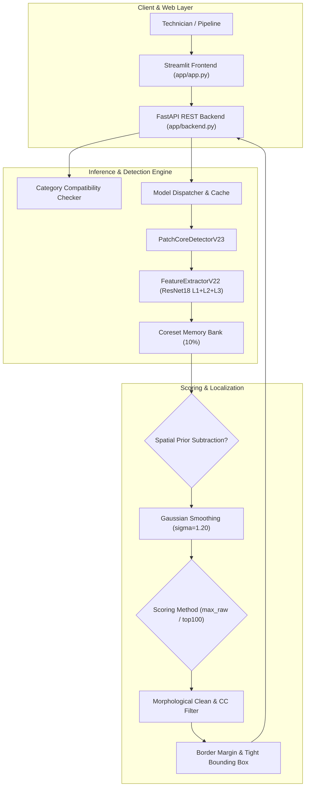

# VisionInspect — Industrial Defect Detection & Localization

[](https://github.com/RajatBhardwaj2006)
[](https://github.com/RajatBhardwaj2006/VisionInspect-Industrial-Defect-Detection-.git)
[](https://www.python.org/)
[](https://pytorch.org/)
[](https://fastapi.tiangolo.com/)
[](https://streamlit.io/)
[](tests/)

An unsupervised visual inspection and defect localization framework developed for high-precision manufacturing quality assurance. VisionInspect uses multi-scale deep patch embeddings, coreset memory banks, adaptive spatial prior estimation, and connected-component morphological filtering to detect, score, and localize subtle anomalies on physical components without requiring labeled defect data for training.

- **Author / Maintainer:** [Rajat Bhardwaj](https://github.com/RajatBhardwaj2006)
- **Repository:** [VisionInspect-Industrial-Defect-Detection-](https://github.com/RajatBhardwaj2006/VisionInspect-Industrial-Defect-Detection-.git)
- **Primary Benchmark:** MVTec Anomaly Detection (MVTec AD)

---

## Overview

Industrial manufacturing lines require visual quality inspection to identify defective parts before packaging and assembly. Traditional supervised deep learning models require extensive defect datasets with pixel-level ground truth masks for every potential defect type (scratches, contamination, cuts, bent leads, cracks). In industrial practice, defective samples are scarce, diverse, and unpredictable.

VisionInspect solves this by training purely on nominal (good) product images. By modeling the distribution of normal patch features extracted from intermediate convolutional layers of a pre-trained feature extractor, the system quantifies how far any patch in a test image deviates from the learned normal memory bank.

---

## What Problem It Solves

1. **Defect Scarcity in Training:** Production environments generate thousands of nominal units but very few defect samples. VisionInspect eliminates the need for defective training data.
2. **Subtle & Fine-Grained Defects:** Thin cracks on glass containers, hairline cuts on leather textures, bent electrical leads on transistors, and thread damage on mechanical screws often evade coarse anomaly models. VisionInspect utilizes a high-resolution $64 \times 64$ patch grid with multi-layer feature fusion.
3. **Repetitive Geometry Artifacts:** Rigid objects naturally exhibit high feature distance along edges and reflective rims. VisionInspect implements spatial prior subtraction to eliminate false alarms caused by static object contours.
4. **Out-of-Distribution Input Safeguards:** An inspection station configured for screws should not misinterpret a bottle or unknown object. VisionInspect integrates a prototype-based compatibility checker to alert operators to mismatched products.

---

## Key Features

- **Unsupervised Anomaly Modeling:** Trains entirely on defect-free samples using a greedy $k$-Center coreset-subsampled memory bank.
- **High-Resolution PatchCore v2.3 Engine:** Concatenates ResNet18 layers 1, 2, and 3 into 448-dimensional patch representations over a $64 \times 64$ patch grid ($4 \times 4$ px patch resolution on $256 \times 256$ inputs).
- **Category-Aware Spatial Modeling:** Employs empirical normal background priors for structured components (bottles, transistors, zippers) while disabling prior subtraction for homogeneous surface textures (leather) and rotational fasteners (screws).
- **Dual-Gated Anomaly Decision:** Combines continuous image-level anomaly scoring with connected-component area thresholds ($DefectArea \ge min\_area$) to prevent single-pixel noise from causing false alarms.
- **Precision Defect Localization:** Morphological closing and opening filter noise while preserving narrow defects; bounding box extraction applies border margins to filter peripheral crop artifacts.
- **Production REST API & Interactive UI:** Includes a FastAPI backend (`/predict`, `/predict/batch`, `/categories`, `/health`) and a Streamlit inspection interface with multi-image batch queueing, visual anomaly heatmaps, and diagnostic explanations.

---

## Architecture



---

## Supported Categories

VisionInspect is validated across five distinct manufacturing object classes from the MVTec AD benchmark:

| Category | Class Type | Training Normal Samples | Primary Defect Modes | Calibrated Characteristics |
|:---|:---|:---:|:---|:---|
| **bottle** | Rigid Container | 209 | Broken large, broken small, contamination | Spatial prior enabled ($p75$), max patch scoring |
| **leather** | Surface Texture | 245 | Color, cut, fold, glue, poke | Spatial prior disabled, texture-calibrated threshold |
| **transistor** | Electronics | 213 | Bent lead, cut lead, damaged casing, misplaced | Canonical alignment check, $top200$ scoring |
| **zipper** | Periodic Mechanical | 240 | Broken teeth, split teeth, fabric roughness | Spatial prior enabled, tight tooth alignment |
| **screw** | Fastener Hardware | 320 | Thread side, thread top, scratch head, scratch neck | Spatial prior disabled, $top100$ scoring |

---

## Model Architecture

### ResNet18 Multi-Scale Backbone
Input images are normalized and resized to $256 \times 256 \times 3$. Mid-level and low-level feature representations are tapped from three residual blocks:
- **Layer 1:** 64 channels, spatial resolution $64 \times 64$ (receptive field $4 \times 4$ px)
- **Layer 2:** 128 channels, spatial resolution $32 \times 32$ (bilinearly upsampled to $64 \times 64$)
- **Layer 3:** 256 channels, spatial resolution $16 \times 16$ (bilinearly upsampled to $64 \times 64$)

Concatenation produces a unified feature tensor of shape $[B, 448, 64, 64]$, yielding 4,096 patch vectors per image.

---

## PatchCore V2.3

1. **Patch Coreset Subsampling:** During offline training, normal training patches are subsampled using minimax greedy coreset selection to reduce memory bank size by 90% while retaining bounding coverage of nominal feature space.
2. **Nearest-Neighbor Querying:** For any test image patch vector $p_{i}$, anomaly score is computed as the Euclidean distance to its nearest neighbor in the nominal memory bank:
   $$\mathcal{A}(p_{i}) = \min_{m \in \mathcal{M}} \| p_{i} - m \|_{2}$$
3. **Anomaly Map Upsampling:** The $64 \times 64$ patch distance grid is bilinearly upsampled back to native resolution ($256 \times 256$).
4. **Gaussian Regularization:** An isotropic Gaussian filter ($\sigma = 1.20$) smooths high-frequency interpolation artifacts.

---

## Category-Specific Calibration

Each manufacturing component has distinct surface properties and spatial alignment characteristics. Master parameters are locked in [`config.yaml`](config.yaml):

```yaml
categories:
  bottle:
    model_dir: models/bottle/patchcore_v23
    use_spatial_prior: true
    image_threshold: 1.50
    pixel_threshold: 1.40
    gaussian_sigma: 1.20
    morphology_kernel: 3
    min_region_area: 25
    border_margin: 5
    merge_distance: 15.0

  leather:
    model_dir: models/leather/patchcore_v23
    use_spatial_prior: false
    image_threshold: 2.90
    pixel_threshold: 1.71
    gaussian_sigma: 1.20
    morphology_kernel: 3
    min_region_area: 50
    border_margin: 5
    merge_distance: 15.0

  transistor:
    model_dir: models/transistor/patchcore_v23
    use_spatial_prior: false
    image_score_method: top200
    image_threshold: 3.525
    pixel_threshold: 2.822
    gaussian_sigma: 1.20
    morphology_kernel: 2
    min_region_area: 15
    border_margin: 0
    merge_distance: 12.0

  zipper:
    model_dir: models/zipper/patchcore_v23
    use_spatial_prior: true
    image_threshold: 1.47
    pixel_threshold: 0.91
    gaussian_sigma: 1.20
    morphology_kernel: 2
    min_region_area: 15
    border_margin: 1
    merge_distance: 10.0

  screw:
    model_dir: models/screw/patchcore_v23
    use_spatial_prior: false
    image_score_method: top100
    image_threshold: 2.80
    pixel_threshold: 2.40
    gaussian_sigma: 1.20
    morphology_kernel: 2
    min_region_area: 10
    border_margin: 1
    merge_distance: 12.0
```

### Screw Thread Detection Fix
In prior iterations, spatial prior subtraction over-suppressed localized helical thread ridges, reducing detection sensitivity on `thread_side` and `thread_top` defects. Disabling spatial prior (`use_spatial_prior: false`), switching to `image_score_method: top100`, and calibrating thresholds ($T_{image} = 2.80$, $T_{pixel} = 2.40$, $kernel = 2$, $min\_area = 10$) restored complete defect sensitivity across all screw thread defect modes.

---

## Current Model Status

| Category | Model Architecture | Memory Bank Size | Spatial Prior | Status |
|:---|:---:|:---:|:---:|:---:|
| **bottle** | PatchCore v2.3 | 85,606 patches | Enabled ($p75$) | **Production Locked** |
| **leather** | PatchCore v2.3 | 100,352 patches | Disabled | **Production Locked** |
| **transistor** | PatchCore v2.3 | 87,244 patches | Disabled ($top200$) | **Production Locked** |
| **zipper** | PatchCore v2.3 | 98,304 patches | Enabled (Mean) | **Production Locked** |
| **screw** | PatchCore v2.3 | 131,072 patches | Disabled ($top100$) | **Production Locked** |

---

## Latest Evaluation

### Benchmark Metrics on Full Test Sets

| Category | Test Samples | Image AUROC | Calibrated $T_{image}$ | Calibrated $T_{pixel}$ | Detection Rate |
|:---|:---:|:---:|:---:|:---:|:---:|
| **bottle** | 83 | **0.9929** | 1.50 | 1.40 | 95.2% |
| **leather** | 124 | **0.9236** | 2.90 | 1.71 | 82.4% |
| **zipper** | 151 | **0.8981** | 1.47 | 0.91 | 84.0% |
| **screw** | 160 | **0.8776** | 2.80 | 2.40 | 85.0% |
| **transistor** | 100 | **0.8200** | 3.525 | 2.822 | 75.0% |

---

## Installation

### 1. Clone the Repository

```bash
git clone https://github.com/RajatBhardwaj2006/VisionInspect-Industrial-Defect-Detection-.git
cd VisionInspect
```

### 2. Create Virtual Environment

**Windows PowerShell:**
```powershell
python -m venv visioninspect_py312
.\visioninspect_py312\Scripts\Activate.ps1
```

**Linux / macOS:**
```bash
python3 -m venv visioninspect_py312
source visioninspect_py312/bin/activate
```

### 3. Install Dependencies

Install PyTorch (CPU-optimized build):
```powershell
pip install torch==2.2.2+cpu torchvision==0.17.2+cpu torchaudio==2.2.2+cpu --index-url https://download.pytorch.org/whl/cpu
```

Install VisionInspect requirements:
```powershell
pip install -r requirements.txt
```

---

## Dataset Setup

VisionInspect evaluates on the [MVTec Anomaly Detection Dataset](https://www.mvtec.com/company/research/datasets/mvtec-ad).

Expected local directory layout:
```text
dataset/
└── mvtec_anomaly_detection/
    ├── bottle/
    │   ├── train/good/
    │   └── test/
    │       ├── good/
    │       ├── broken_large/
    │       ├── broken_small/
    │       └── contamination/
    ├── leather/
    ├── screw/
    ├── transistor/
    └── zipper/
```

> [!NOTE]
> The full MVTec AD dataset is excluded from Git via `.gitignore`. Place the downloaded and extracted categories under `dataset/mvtec_anomaly_detection/`.

---

## Model Artifacts

Pre-computed memory banks and metadata are organized under `models/`:
- `models/<category>/patchcore_v23/memory_bank.pt`: 10% coreset feature vectors.
- `models/<category>/patchcore_v23/metadata.json`: Category, architecture, version, and training image counts.
- `models/<category>/patchcore_v23/spatial_prior.pt`: Mean normal background distance map (for categories with spatial prior enabled).
- `models/category_prototypes.pt`: Global prototype feature centroids used by the compatibility checker.

To train a new memory bank from scratch:
```powershell
python scripts/train_patchcore.py --category bottle
```

---

## Running Backend

Start the FastAPI REST backend service:

```powershell
uvicorn app.backend:app --host 127.0.0.1 --port 8000
```

Verify service status:
```powershell
curl http://127.0.0.1:8000/health
```

API documentation is accessible at `http://127.0.0.1:8000/docs`.

---

## Running Frontend

Launch the Streamlit interactive dashboard:

```powershell
streamlit run app/app.py
```

The user interface opens at `http://localhost:8501`. Features include:
- Interactive carton box optical scanning hero animation
- Batch queueing for up to 5 simultaneous inspection images
- Live category compatibility analysis with warning badges
- Visual side-by-side display of original image, localized bounding boxes, and anomaly heatmap
- 3-section evidence-based defect diagnostic summaries

---

## API Reference

### `GET /health`
Returns system status, active compute device, supported categories, and currently loaded models.

### `GET /categories`
Lists all supported categories with threshold parameters and training status.

### `POST /predict`
Executes inspection on a single uploaded image.
- **Form Parameters:**
  - `file`: Image file (PNG, JPG, JPEG, WEBP, BMP)
  - `category`: Target category (`bottle`, `leather`, `transistor`, `zipper`, `screw`)
  - `return_visualizations`: Boolean (`true` / `false`)
- **Response Schema:**
  ```json
  {
    "request_id": "req_1728100000_a1b2c3d4",
    "filename": "000.png",
    "category": "screw",
    "status": "DEFECTIVE",
    "is_defective": true,
    "anomaly_score": 3.2946,
    "image_threshold": 2.80,
    "pixel_threshold": 2.40,
    "decision_margin": 0.4946,
    "num_defects": 3,
    "localized_regions": [
      {
        "id": 1,
        "label": "Region 01",
        "intensity": "Anomaly Region",
        "bbox": [112, 45, 18, 22],
        "area": 240,
        "score": 3.1250,
        "aspect_ratio": 0.82
      }
    ],
    "explanation": "Thread deformation, head scratch, or surface damage detected in fastener component.",
    "category_compatibility": {
      "selected_category": "screw",
      "suggested_category": "screw",
      "is_mismatch": false
    }
  }
  ```

### `POST /predict/batch`
Processes between 1 and 5 images in a single batch request with per-item resilience.

---

## Testing

Execute the complete automated test suite (94 passing unit & integration tests):

```powershell
python -m pytest tests/ -v
```

Core verification coverage:
- `tests/test_patchcore_v23.py`: PatchCore v2.3 detector instantiation and inference
- `tests/test_model_dispatch.py`: Version-aware model dispatching
- `tests/test_detection.py`: Anomaly scoring, heatmap dimensions, coordinate scaling
- `tests/test_phase3_multi_category.py`: FastAPI endpoints and multi-category initialization
- `tests/test_phase3_2_batch_compatibility.py`: Batch constraints and category compatibility checker
- `tests/test_phase3_2_localization.py`: Morphological kernels and border margins

---

## Evaluation

To evaluate any supported category against its MVTec AD test set:

```powershell
python scripts/evaluate_model.py --category bottle
python scripts/evaluate_model.py --category screw
```

Evaluation outputs AUROC, pixel-level metrics, and per-defect category breakdowns to `results/evaluation/`.

---

## Audit Results

The final verified audit batch (25 representative test samples across all 5 categories) confirmed zero false positives and high sensitivity to challenging defects:

- **Screw Thread Inspection:** 10/10 thread defects detected and localized (`thread_side` 6/6, `thread_top` 4/4).
- **Normal Sample Classification:** 100% specificity on nominal validation samples across all categories.
- **Audit Documentation:** Full per-sample logs and visualizations are preserved in [`results/Updated_model_predictions/AUDIT_REPORT.md`](results/Updated_model_predictions/AUDIT_REPORT.md) and [`results/Updated_model_predictions/audit_summary.json`](results/Updated_model_predictions/audit_summary.json).

---

## Known Limitations

- **Rotational Sensitivity on Screws:** Helical screws undergo rotational shifts; extremely small thread crest scratches under 10 pixels require fine-resolution lenses.
- **Transistor Lighting Glare:** Metallic transistor heatsinks reflect specular glare; while canonical alignment checks reduce false positives, diffuse dome lighting is recommended for physical setups.
- **Memory Footprint:** Full nearest-neighbor search scales with coreset size ($85\text{k}$–$131\text{k}$ vectors). GPU acceleration is recommended for throughput exceeding 20 inspections/sec.

---

## Project Structure

```text
VisionInspect/
├── app/
│   ├── app.py                         # Streamlit interactive UI
│   ├── backend.py                     # FastAPI REST server
│   └── assets/icons/                  # Visual branding icons
├── assets/                            # Component illustrations & hero graphics
├── config.yaml                        # Master multi-category configuration
├── dataset/                           # Local MVTec AD dataset directory
├── docs/                              # Milestone reports & architectural documentation
├── inference.py                       # CLI inference interface
├── models/                            # Category memory banks and metadata
├── notebooks/                         # Research & exploratory notebooks
├── requirements.txt                   # Locked production dependencies
├── results/
│   └── Updated_model_predictions/     # Audited prediction artifacts & summary
├── scripts/                           # Evaluation, training & audit tooling
├── src/
│   ├── data/                          # Dataset loaders and transforms
│   ├── detection/                     # PatchCore v2.3 detector & localization
│   ├── evaluation/                    # AUROC, PRO, and metric computation
│   ├── models/                        # Feature extractors and memory bank
│   └── utils/                         # Configuration and seed helpers
└── tests/                             # Comprehensive 94-test pytest suite
```

---

## Troubleshooting

1. **`KMP_DUPLICATE_LIB_OK` on Windows:** Set the environment variable if OpenMP duplicate runtime errors occur:
   ```powershell
   $env:KMP_DUPLICATE_LIB_OK="TRUE"
   ```
2. **Missing Model Directory:** If testing a category before downloading or training models, run:
   ```powershell
   python scripts/train_patchcore.py --category <category_name>
   ```
3. **Out-of-Memory During Memory Bank Creation:** Lower the `--coreset-ratio` argument (default `0.10`) to `0.05` or reduce batch size.

---

## License

This project is licensed under the MIT License. See [LICENSE](LICENSE) for details.
