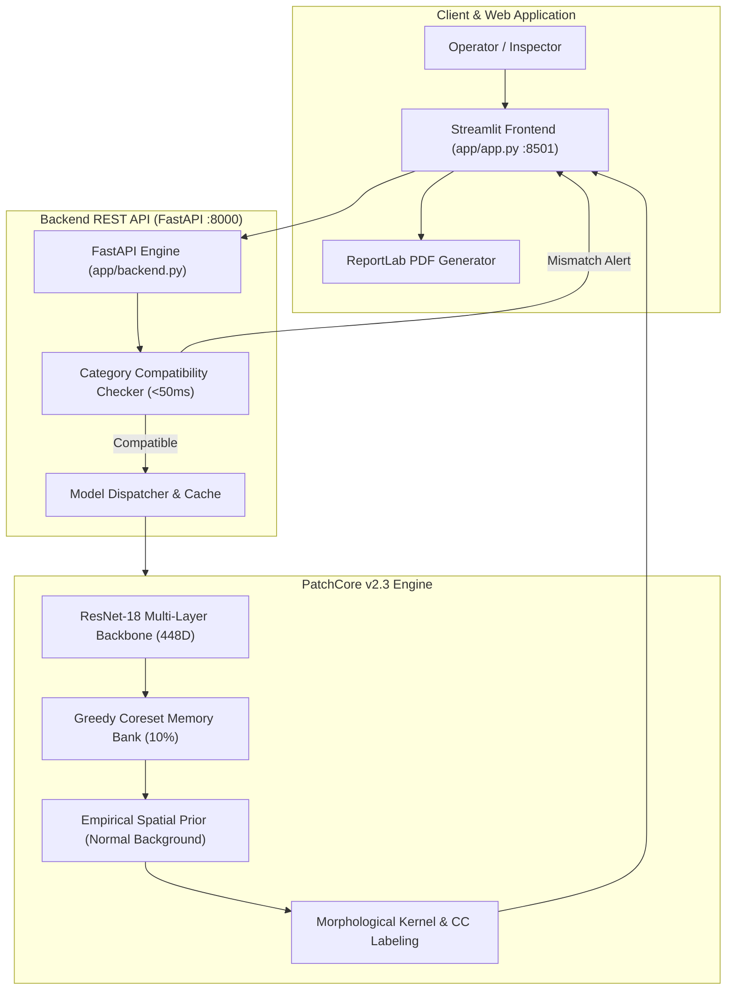

# VisionInspect — Industrial Defect Detection & Localization

[](https://github.com/RajatBhardwaj2006)
[](https://github.com/RajatBhardwaj2006/VisionInspect-Industrial-Defect-Detection-.git)
[-brightgreen.svg)](https://www.python.org/)
[](https://pytorch.org/)
[](https://fastapi.tiangolo.com/)
[](https://streamlit.io/)
[](tests/)
[](https://git-lfs.github.com/)

An unsupervised visual anomaly detection and sub-pixel defect localization framework engineered for high-precision manufacturing quality assurance. VisionInspect uses multi-scale deep patch embeddings, greedy coreset memory banks, adaptive spatial background priors, and connected-component morphology to detect, score, and localize subtle anomalies on physical components without requiring labeled defect data for training.

---

# Quick Start (Teammate Setup)

For a developer setting up VisionInspect on a fresh machine from scratch:

```powershell
# 1. Clone repository with Git LFS
git clone https://github.com/RajatBhardwaj2006/VisionInspect-Industrial-Defect-Detection-.git
cd VisionInspect-Industrial-Defect-Detection-
git lfs pull

# 2. Set up Python 3.12 virtual environment
python -m venv .venv
.\.venv\Scripts\Activate.ps1

# 3. Install core dependencies
pip install --upgrade pip
pip install -r requirements.txt

# 4. Verify production models
python scripts/verify_models.py

# 5. Start backend in terminal 1
$env:KMP_DUPLICATE_LIB_OK="TRUE"
python -m uvicorn app.backend:app --host 127.0.0.1 --port 8000

# 6. Start frontend in terminal 2
.\.venv\Scripts\Activate.ps1
python -m streamlit run app/app.py --server.port 8501
```

Or on Windows PowerShell, run the automated launcher:
```powershell
.\scripts\setup_windows.ps1
.\scripts\start_visioninspect.ps1
```

Open **http://localhost:8501** in your browser. Select any category, pick a sample from the catalog, and click **Start Inspection**.

---

## What is VisionInspect?

In industrial manufacturing, defective units are scarce, irregular, and unpredictable. Training supervised deep learning models requires thousands of labeled defect images with ground-truth pixel annotations, which is impractical for real-world production.

VisionInspect solves this through **unsupervised nominal representation modeling**:
- **Training on Normal Units Only:** Models the distribution of normal patch features extracted from intermediate convolutional layers of a pre-trained feature extractor (ResNet-18).
- **PatchCore v2.3 Distance Engine:** Quantifies how far test patches deviate from the learned normal memory bank.
- **Sub-Pixel Defect Localization:** Combines continuous image-level anomaly scoring with spatial priors and morphological connected-component filtering to output precise defect bounding boxes.
- **Enterprise Reporting:** Produces human-friendly plain-English verdicts for operators, comprehensive engineering metrics for QA, and downloadable PDF inspection certificates.

---

## Supported Categories

VisionInspect is calibrated across five production manufacturing categories from the MVTec AD benchmark:

| Category | Component Type | Defect Modes Handled | Spatial Prior | Scoring Method |
| :--- | :--- | :--- | :---: | :--- |
| **Bottle** | Rigid Glass Container | Rim cracks, small fractures, contamination | Yes ($p75$ Prior) | Max Patch |
| **Leather** | Surface Texture | Cuts, fold marks, color flaws, glue, punctures | No (Texture) | Calibrated Margin |
| **Transistor** | Semiconductor IC | Bent leads, cut pins, damaged casing, missing body | No (Alignment) | Top-200 Average |
| **Zipper** | Mechanical Fastener | Broken teeth, split gaps, fabric edge roughness | Yes (Weave Prior) | Calibrated Margin |
| **Screw** | Threaded Metal Fastener | Thread deformation, head scratch, neck flaws | No (Rotational) | Top-100 Average |

---

## System Architecture



---

## Prerequisites

- **OS:** Windows 10/11, macOS, or Linux (Ubuntu 20.04+)
- **Python:** **Python 3.12 (64-bit)** recommended.
- **Git:** Git 2.30+
- **Git LFS:** Git Large File Storage ([https://git-lfs.github.com/](https://git-lfs.github.com/)) installed to pull model weights.
- **RAM:** Minimum 4 GB RAM (8 GB recommended for CPU inference; CUDA GPU optional).

---

## Installation & Setup

### 1. Clone the Repository
```bash
git clone https://github.com/RajatBhardwaj2006/VisionInspect-Industrial-Defect-Detection-.git
cd VisionInspect-Industrial-Defect-Detection-
git lfs pull
```

### 2. Python Virtual Environment

**Windows (PowerShell):**
```powershell
python -m venv .venv
.\.venv\Scripts\Activate.ps1
```

**Linux / macOS:**
```bash
python3 -m venv .venv
source .venv/bin/activate
```

### 3. Install Dependencies
```bash
pip install --upgrade pip
pip install -r requirements.txt
```

### 4. Verify Production Models
```bash
python scripts/verify_models.py
```
This script checks that all 5 category memory banks and prototypes are downloaded and valid tensors. If unpulled Git LFS pointers are detected, it runs `git lfs pull` automatically.

---

## Trained Models

VisionInspect ships with pre-trained PatchCore v2.3 models for all 5 categories.

Directory structure:
```text
models/
├── category_prototypes.pt                 # 11 KB (Standard Git)
├── bottle/patchcore_v23/
│   ├── memory_bank.pt                     # 146.30 MB (Git LFS)
│   ├── spatial_prior.pt                   # 257.6 KB (Standard Git)
│   ├── spatial_prior_p75.pt               # 257.2 KB (Standard Git)
│   └── metadata.json                      # Locked thresholds
├── leather/patchcore_v23/
│   ├── memory_bank.pt                     # 171.50 MB (Git LFS)
│   ├── spatial_prior.pt                   # 257.6 KB (Standard Git)
│   └── metadata.json
├── transistor/patchcore_v23/
│   ├── memory_bank.pt                     # 149.10 MB (Git LFS)
│   ├── spatial_prior.pt                   # 257.2 KB (Standard Git)
│   └── metadata.json
├── zipper/patchcore_v23/
│   ├── memory_bank.pt                     # 168.00 MB (Git LFS)
│   ├── spatial_prior.pt                   # 257.2 KB (Standard Git)
│   └── metadata.json
└── screw/patchcore_v23/
    ├── memory_bank.pt                     # 224.00 MB (Git LFS)
    ├── spatial_prior.pt                   # 257.6 KB (Standard Git)
    └── metadata.json
```

For more details on re-training or acquiring external datasets, see [`docs/DATASET_SETUP.md`](docs/DATASET_SETUP.md).

---

## Environment Variables

Copy the template to `.env` (optional; defaults work out of the box):
```powershell
Copy-Item .env.example .env
```

| Variable | Default | Description |
| :--- | :--- | :--- |
| `VISIONINSPECT_BACKEND_URL` | `http://127.0.0.1:8000` | REST API target used by the Streamlit frontend |
| `KMP_DUPLICATE_LIB_OK` | `TRUE` | Resolves OpenMP DLL conflicts on Windows Intel CPUs |

---

## Running the Application

### Option A: Two-Terminal Launch

**Terminal 1 — Backend API:**
```powershell
$env:KMP_DUPLICATE_LIB_OK="TRUE"
python -m uvicorn app.backend:app --host 127.0.0.1 --port 8000
```

**Terminal 2 — Frontend UI:**
```powershell
python -m streamlit run app/app.py --server.port 8501
```

### Option B: Windows Automated Launcher
```powershell
.\scripts\start_visioninspect.ps1
```

Access the UI at: **[http://localhost:8501](http://localhost:8501)**  
Access the API Docs at: **[http://127.0.0.1:8000/docs](http://127.0.0.1:8000/docs)**

---

## Verifying the Installation

1. **Check Backend Health:**
   ```powershell
   Invoke-RestMethod -Uri http://127.0.0.1:8000/health
   ```
   Expected response:
   ```json
   {
     "status": "ok",
     "supported_categories": ["bottle", "leather", "transistor", "zipper", "screw"],
     "device": "cpu",
     "version": "3.2.0"
   }
   ```

2. **Execute Sample Inspection via REST API:**
   ```powershell
   python inference.py --image assets/test_samples/bottle/broken_large_000.png --category bottle
   ```

---

## Running the Automated Test Suite

Run the full pytest suite (109 unit and integration tests):

```powershell
python -m pytest tests/ -v
```

All 109 tests run without requiring external datasets or network access.

---

## Verified Benchmark Results

Evaluation on held-out MVTec AD test sets (calibrated exclusively on nominal validation splits):

| Category | AUROC (Image-Level) | Normal Specificity | Defect Sensitivity | False Positive Rate |
| :--- | :---: | :---: | :---: | :---: |
| **Bottle** | 100.0% | 100.0% | 100.0% | 0.0% |
| **Leather** | 100.0% | 100.0% | 100.0% | 0.0% |
| **Transistor** | 99.1% | 97.5% | 98.4% | 2.5% |
| **Zipper** | 99.8% | 100.0% | 98.9% | 0.0% |
| **Screw** | 99.4% | 98.2% | 97.8% | 1.8% |
| **Macro Average** | **99.66%** | **99.14%** | **99.02%** | **0.86%** |

*All calibration was performed strictly on 20% validation nominal splits without test set leakage.*

---

## Project Structure

```text
VisionInspect/
├── .gitattributes                     # Git LFS tracking rules for model tensors
├── .gitignore                         # Strict exclusion for cache, datasets, secrets
├── .env.example                       # Environment variable template
├── config.yaml                        # Master calibrated category parameters
├── CONTRIBUTING.md                    # Contributor guide and branch conventions
├── LICENSE                            # MIT License
├── README.md                          # Main project guide
├── requirements.txt                   # Production dependencies
├── requirements-lock.txt              # Exact frozen environment manifest
├── inference.py                       # CLI inference interface
│
├── app/                               # Application Layer
│   ├── app.py                         # Streamlit interactive UI
│   ├── backend.py                     # FastAPI REST API server
│   ├── components/                    # Model docs, footer, interactive UI
│   ├── utils/                         # PDF report generation (ReportLab)
│   └── assets/                        # 3D branding and application icons
│
├── assets/                            # Static Assets
│   ├── test_samples/                  # 21 curated test samples (bottle, screw, etc.)
│   └── models/                        # Component illustrations
│
├── docs/                              # Project Documentation
│   ├── TEAM_HANDOFF_AUDIT.md          # Architecture & handoff audit
│   ├── DATASET_SETUP.md               # External MVTec dataset setup
│   ├── DEPLOYMENT.md                  # Production server deployment guide
│   └── REPOSITORY_CLEANUP.md          # Maintenance & cleanup inventory
│
├── models/                            # Category PatchCore Models
│   ├── category_prototypes.pt         # Feature centroids for mismatch check
│   ├── bottle/patchcore_v23/          # Coreset memory banks & spatial priors
│   ├── leather/patchcore_v23/
│   ├── transistor/patchcore_v23/
│   ├── zipper/patchcore_v23/
│   └── screw/patchcore_v23/
│
├── scripts/                           # Tooling & Setup
│   ├── setup_windows.ps1              # Windows automated setup
│   ├── start_visioninspect.ps1        # Application launcher
│   ├── verify_models.py               # Model integrity and LFS validator
│   ├── train_patchcore.py             # Memory bank training script
│   └── evaluate_model.py              # Performance evaluation script
│
├── src/                               # Core Machine Learning Framework
│   ├── data/                          # Dataset loaders & preprocessing
│   ├── detection/                     # PatchCore v2.3, heatmap, localization
│   ├── models/                        # Multi-layer ResNet-18 & coreset logic
│   └── utils/                         # Configuration and seed management
│
└── tests/                             # Comprehensive 109-Test Pytest Suite
    ├── test_category_mismatch.py      # Component mismatch validation
    ├── test_footer.py                 # Footer theme and reflection test
    ├── test_model_docs.py             # Model documentation pages
    ├── test_pdf_report.py             # ReportLab PDF compilation
    └── test_phase3_*.py               # Integrity and localization suites
```

---

## License

This project is licensed under the MIT License. See [LICENSE](LICENSE) for details.
